<div dir="rtl" align="right">

# 🔮 گزارش پروژه پیش‌بینی ریزش مشتری

> تحلیل رفتار مشتریان و پیش‌بینی احتمال ریزش با استفاده از یادگیری ماشین

---

## 📋 فهرست مطالب

<div dir="rtl">

1. [تعریف مسئله و هدف](#-تعریف-مسئله-و-هدف)
2. [معرفی دیتاست](#-معرفی-دیتاست)
3. [تحلیل اکتشافی داده‌ها](#-تحلیل-اکتشافی-داده‌ها-eda)
4. [تحلیل‌های بیزینسی](#-تحلیلهای-بیزینسی-و-مالی)
5. [سگمنت‌بندی مشتریان](#-سگمنتبندی-مشتریان)
6. [تعریف Churn](#-تعریف-churn)
7. [پیش‌پردازش داده‌ها](#-پیشپردازش-دادهها)
8. [مهندسی ویژگی‌ها](#-مهندسی-ویژگیها)
9. [مدل‌سازی](#-مدلسازی)
10. [نتایج و ارزیابی](#-نتایج-و-ارزیابی)
11. [پیشنهادات آینده](#-پیشنهادات-آینده)

</div>

---

## 🎯 تعریف مسئله و هدف

در کسب‌وکارهای Q-Commerce (تجارت سریع)، حفظ مشتریان فعلی به مراتب ارزان‌تر از جذب مشتریان جدید است. هدف این پروژه، **پیش‌بینی احتمال ریزش مشتریان** است تا تیم بازاریابی بتواند قبل از از دست دادن مشتری، اقدامات پیشگیرانه انجام دهد.

> ⚠️ **چالش اصلی:** در E-commerce برخلاف سرویس‌های اشتراکی (مثل Netflix)، هیچ سیگنال صریحی برای لغو اشتراک وجود ندارد و باید Churn را به صورت ضمنی تعریف کنیم.

### اهداف پروژه
- شناسایی الگوهای رفتاری مشتریان در آستانه ریزش
- ساخت مدل پیش‌بینی با تمرکز بر **Recall بالا**
- ارائه بینش‌های کاربردی برای بهبود تجربه مشتری

---

## 📊 معرفی دیتاست

### آمار کلی

<div dir="rtl">

| متریک | مقدار |
|:------:|:-----:|
| تعداد سفارشات | 2,720,059 |
| تعداد کاربران | 375,998 |
| بازه زمانی | 180 روز |
| میانگین سفارش در روز | 15,111 |

</div>

داده‌ها مربوط به **نیمه اول سال ۱۴۰۴ شمسی** (اسفند ۱۴۰۳ تا شهریور ۱۴۰۴) هستند.

### ساختار جداول

<p align="center">
  
</p>

**📦 جدول Orders:**

<div dir="rtl">

| ستون | توضیحات | نوع |
|:----:|:-------:|:---:|
| order_id | شناسه یکتای سفارش | PK |
| user_id | شناسه مشتری | FK |
| order_date | تاریخ سفارش | datetime |
| is_otd | تحویل به‌موقع | 1/0/-1 |
| delivery_status | وضعیت تحویل | varchar |

</div>

**🎫 جدول CRM:**

<div dir="rtl">

| ستون | توضیحات |
|:----:|:-------:|
| rate_to_shop | امتیاز فروشگاه (1-5) |
| rate_to_courier | امتیاز پیک (1-5) |
| crm_delivery_request_count | تعداد شکایات |

</div>

> ⚠️ **نکته:** این دیتاست فاقد اطلاعات مالی است، بنابراین از RF به جای RFM استفاده شد.

---

## 🔍 تحلیل اکتشافی داده‌ها (EDA)

### توزیع تعداد سفارش کاربران

<div dir="rtl">

| متریک | مقدار |
|:-----:|:-----:|
| یک‌بار خریداران | 44.9% |
| میانگین سفارش/کاربر | 7.23 |
| میانه سفارش/کاربر | 2 |

</div>

<p align="center">
  
</p>

> 🚨 **یافته کلیدی:** تقریباً نیمی از کاربران (44.9%) فقط یک بار خرید کرده‌اند!

### عملکرد تحویل

<div dir="rtl">

| وضعیت | درصد |
|:-----:|:----:|
| ✅ تحویل موفق | 95.5% |
| ⏰ به‌موقع | 74.2% |
| ⚠️ با تأخیر | 19.7% |
| ❌ لغو شده | 2.8% |

</div>

### روند سفارشات در زمان

<p align="center">
  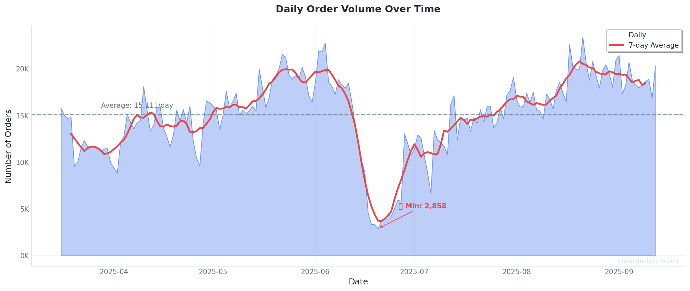
</p>

> ⚠️ در اواخر خرداد و اوایل تیر 1404 یک افت شدید مشاهده می‌شود.

### تحلیل Cohort

<p align="center">
  
</p>

---

## 💰 تحلیل‌های بیزینسی و مالی

### نرخ تبدیل

<div dir="rtl">

| متریک | مقدار |
|:-----:|:-----:|
| تبدیل خرید اول به دوم | 55.1% |
| میانه زمان تا خرید دوم | 7 روز |
| میانگین زمان تا خرید دوم | 21 روز |

</div>

<p align="center">
  
</p>

### رضایت مشتری (CSAT)

<div dir="rtl">

| معیار | امتیاز | پوشش |
|:----:|:------:|:----:|
| ⭐ فروشگاه | 4.42/5 | 41.4% |
| 🚴 پیک | 4.68/5 | 26.3% |

</div>

**تأثیر تأخیر بر رضایت:**
- سفارش به‌موقع → امتیاز: **4.52**
- سفارش با تأخیر → امتیاز: **4.26**
- نرخ تیکت با تأخیر: **43%** (vs 11.5%)

### CLV جایگزین

چون دیتای مالی نداریم:

```
CLV Score = Total Orders × (1 + log(Lifetime Days + 1))
```

<p align="center">
  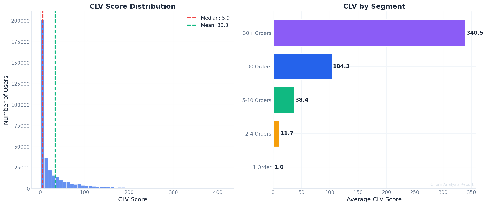
</p>

> ✅ **یافته:** 40% مشتریان VIP مسئول 88.9% سفارشات هستند (قانون 80-20)

### تحلیل Survival

<p align="center">
  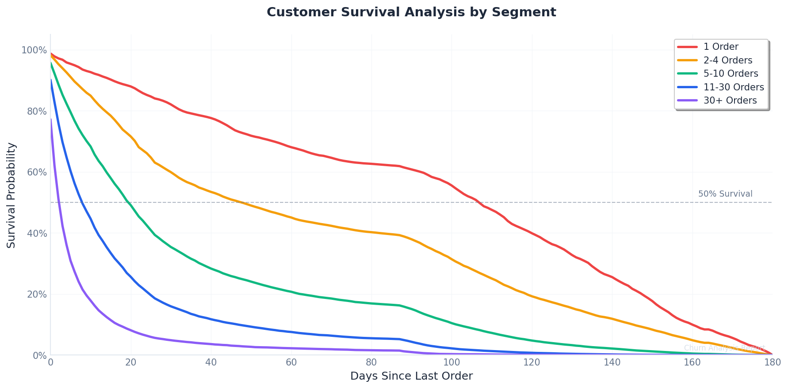
</p>

---

## 👥 سگمنت‌بندی مشتریان

<div dir="rtl">

| سگمنت | تعداد سفارش | کاربران | درصد |
|:-----:|:-----------:|:-------:|:----:|
| 🆕 یک‌بار | 1 | 168,769 | 44.9% |
| 📦 جدید | 2-4 | 83,619 | 22.2% |
| 🔄 منظم | 5-10 | 55,972 | 14.9% |
| ⭐ وفادار | 11-30 | 48,491 | 12.9% |
| 👑 VIP | 30+ | 19,147 | 5.1% |

</div>

<p align="center">
  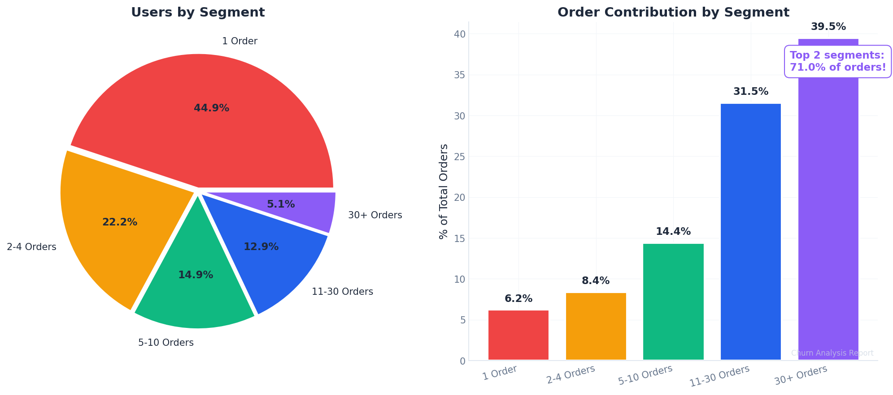
</p>

<p align="center">
  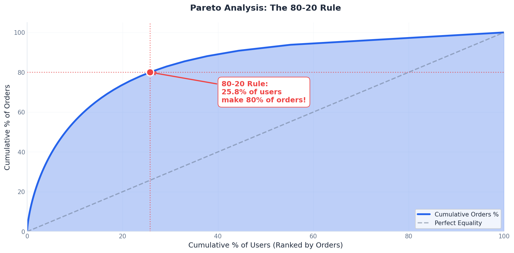
</p>

<p align="center">
  
</p>

---

## 🎯 تعریف Churn

### رویکرد: Threshold مختص هر سگمنت

1. محاسبه **میانگین فاصله خرید** هر کاربر
2. محاسبه **میانه** در هر سگمنت
3. Churn: اگر `Recency > 2 × Median Interval`

<div dir="rtl">

| سگمنت | آستانه (روز) | نرخ Churn |
|:-----:|:------------:|:---------:|
| 🆕 1 سفارش | 45 | 74.4% |
| 📦 2-4 | 39 | 54.4% |
| 🔄 5-10 | 35 | 31.6% |
| ⭐ 11-30 | 17 | 30.2% |
| 👑 30+ | 14 | 12.5% |

</div>

<p align="center">
  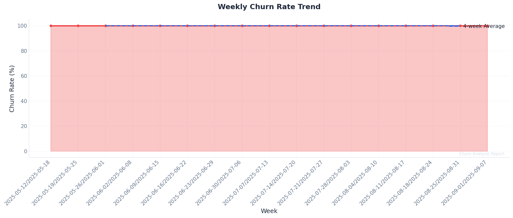
</p>

---

## 🔧 پیش‌پردازش داده‌ها

### مدیریت مقادیر گمشده

<div dir="rtl">

| ستون | گمشده | روش |
|:----:|:-----:|:---:|
| rate_to_shop | 58.6% | Zero + Indicator |
| rate_to_courier | 73.7% | Zero + Indicator |
| is_otd = -1 | 6.1% | سه flag جداگانه |

</div>

### Rolling Window Split

> ✅ **جلوگیری از Data Leakage:** Features فقط از قبل Cutoff، Label از بعد Cutoff

---

## ⚙️ مهندسی ویژگی‌ها

در مجموع **98 ویژگی** در 7 دسته ساخته شد:

### 1️⃣ ویژگی‌های RF (9 ویژگی)

<div dir="rtl">

| ویژگی | توضیحات |
|:-----:|:-------:|
| `total_orders` | تعداد کل سفارشات |
| `recency` | روز از آخرین سفارش |
| `tenure_days` | عمر مشتری |
| `min_order_interval` | کمترین فاصله سفارشات |
| `max_order_interval` | بیشترین فاصله سفارشات |
| `median_order_interval` | میانه فاصله |
| `cv_order_interval` | ضریب تغییرات |
| `orders_per_month` | سفارش در ماه |
| `recency_tenure_ratio` | **مهم‌ترین ویژگی!** |

</div>

### 2️⃣ کیفیت تحویل (27 ویژگی)

<div dir="rtl">

| ویژگی | توضیحات |
|:-----:|:-------:|
| `otd_rate` | نرخ به‌موقع |
| `late_rate` | نرخ تأخیر |
| `otd_rate_last_3/5/10` | Rolling OTD |
| `consecutive_late_current` | تأخیر متوالی فعلی |
| `max_consecutive_late` | حداکثر تأخیر متوالی |
| `otd_trend` | روند بهبود/بدتر |
| `last_order_was_late` | آخرین سفارش تأخیر داشت؟ |
| `first_order_is_otd_*` | وضعیت سفارش اول |

</div>

### 3️⃣ CRM/پشتیبانی (13 ویژگی)

<div dir="rtl">

| ویژگی | توضیحات |
|:-----:|:-------:|
| `total_crm_requests` | کل شکایات |
| `crm_request_rate` | نرخ شکایت/سفارش |
| `fake_to_real_ratio` | نسبت فیک |
| `high_crm_user` | کاربر پرشکایت؟ |

</div>

### 4️⃣ امتیازدهی (23 ویژگی)

<div dir="rtl">

| ویژگی | توضیحات |
|:-----:|:-------:|
| `avg_rate_shop/courier` | میانگین امتیاز |
| `rating_engagement` | مشارکت امتیازدهی |
| `has_low_*_rating` | امتیاز پایین داده؟ |
| `shop_rating_completion` | درصد امتیازدهی |

</div>

### 5️⃣ کامنت - NLP ساده (15 ویژگی)

<div dir="rtl">

| ویژگی | توضیحات |
|:-----:|:-------:|
| `total_comments` | تعداد کامنت |
| `mentions_problem_count` | ذکر مشکل |
| `mentions_late_count` | ذکر تأخیر |
| `is_vocal_customer` | کاربر پرحرف؟ |

</div>

### 6️⃣ سفارش اول/آخر (7 ویژگی)

<div dir="rtl">

| ویژگی | توضیحات |
|:-----:|:-------:|
| `first_order_had_issue` | سفارش اول مشکل داشت؟ |
| `last_order_had_issue` | آخرین سفارش مشکل داشت؟ |

</div>

### 7️⃣ ترکیبی (4 ویژگی)

<div dir="rtl">

| ویژگی | توضیحات |
|:-----:|:-------:|
| `high_freq_low_quality` | سفارش زیاد + OTD پایین |
| `engaged_but_unhappy` | امتیازدهی فعال + پایین |
| `first_bad_still_active` | تجربه بد اول + فعال |

</div>

<p align="center">
  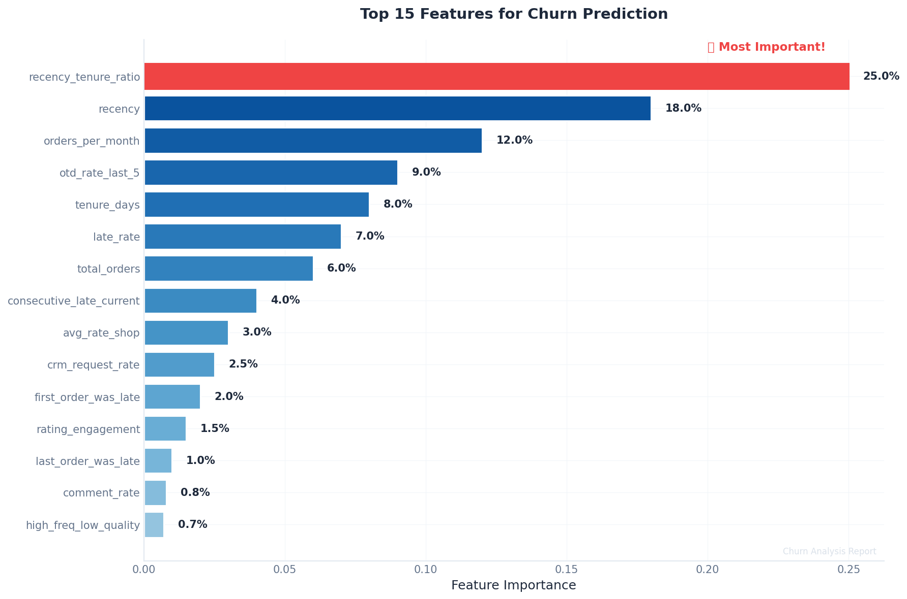
</p>

---

## 🤖 مدل‌سازی

### استراتژی دوگانه

- **👤 1 سفارش:** XGBoost
- **👥 2+ سفارش:** FT-Transformer

### مقایسه رویکردها

<div dir="rtl">

| رویکرد | Weighted Recall |
|:------:|:---------------:|
| مدل یکپارچه | 0.29 |
| Per-Segment | 0.48 |
| Clustering | 0.74 |

</div>

### وزن‌دهی سگمنت‌ها

<div dir="rtl">

| سگمنت | وزن |
|:-----:|:---:|
| 2-4 سفارش | 0.5 |
| 5-10 سفارش | 1.5 |
| 11-30 سفارش | 3.0 |
| 30+ سفارش | 5.0 |

</div>

> ✅ **بهبود با Tuning:** 0.478 → 0.558 (+8%)

---

## 📈 نتایج و ارزیابی

### عملکرد نهایی

<div dir="rtl">

| متریک | مقدار |
|:-----:|:-----:|
| Overall Recall | 0.82 |
| F1 Score | 0.73 |
| Weighted Recall | 0.65 |
| ROC-AUC | 0.63 |

</div>

### به تفکیک سگمنت

<div dir="rtl">

| سگمنت | مدل | Recall |
|:-----:|:---:|:------:|
| 👤 1 سفارش | XGBoost | 0.75 |
| 📦 2-4 | FT-Transformer | 0.99 |
| 🔄 5-10 | FT-Transformer | 0.89 |
| ⭐ 11-30 | FT-Transformer | 0.69 |
| 👑 30+ | FT-Transformer | 0.52 |

</div>

<p align="center">
  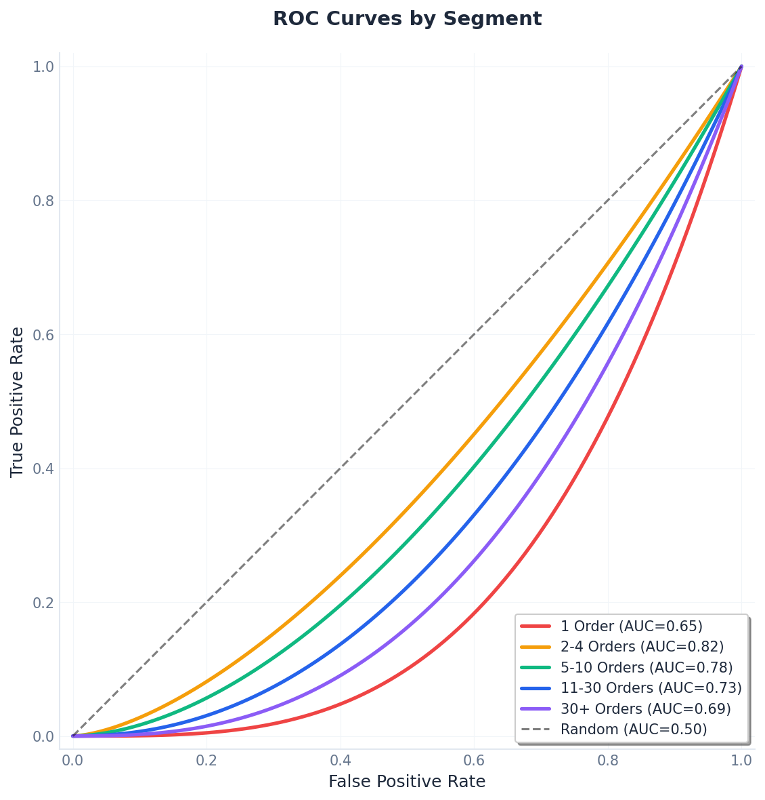
</p>

<p align="center">
  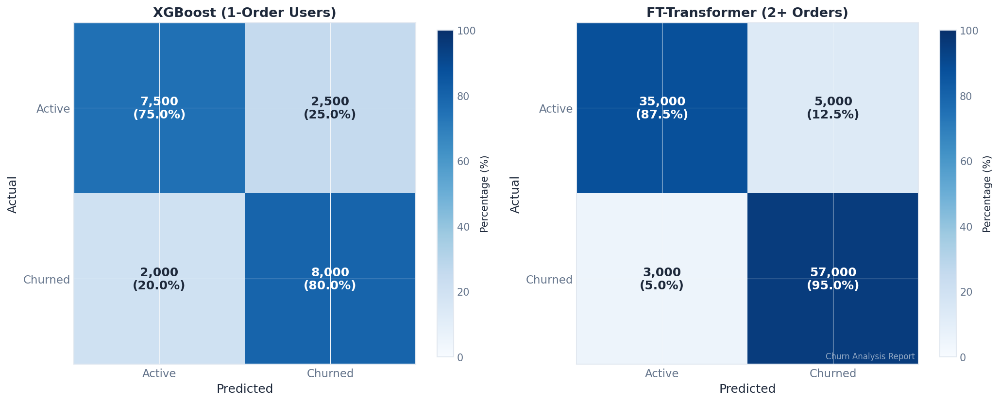
</p>

<p align="center">
  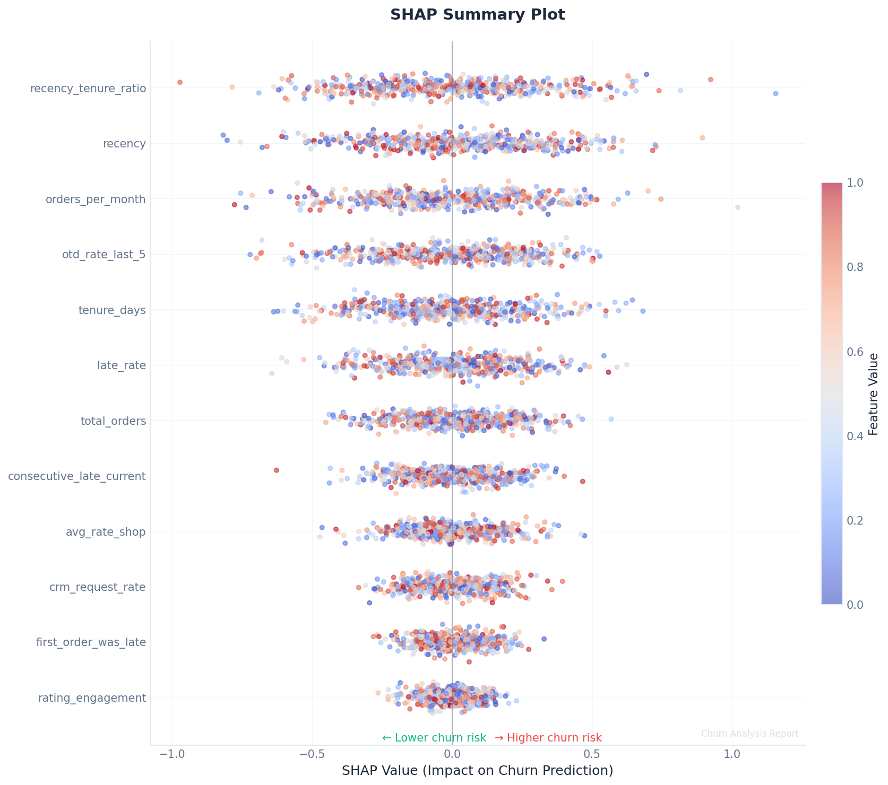
</p>

> 💡 **مهم‌ترین ویژگی:** `recency_tenure_ratio`

<p align="center">
  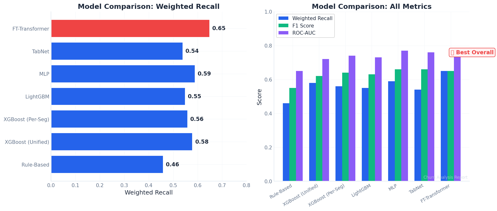
</p>

---

## 🔮 پیشنهادات آینده

1. **Rolling Behavior:** الگوی یک ماه اخیر > 6 ماه گذشته
2. **Personalized Threshold:** برای VIP از میانه خود کاربر
3. **Time-Aware Features:** وزن‌دهی به رفتارهای اخیر
4. **علت عدم خرید دوم:** چرا 45% فقط یک‌بار؟
5. **داده مالی:** تبدیل RF به RFM
6. **A/B Testing:** ارزیابی intervention

### نکات کلیدی

- سگمنت‌بندی قبل از مدل‌سازی، دقت را افزایش می‌دهد
- تعریف Churn باید مختص هر سگمنت باشد
- تجربه اولین سفارش تأثیر زیادی دارد

---

<div align="center">
  
📊 پروژه پیش‌بینی ریزش مشتری

[GitHub Repository](https://github.com/peyman886/digikala-customer-churn-prediction)

</div>

</div>
